# 🚀 ADC-Agents-Team - Pipeline LLM PRO Edition (dev-pipe2)

**Versão Final 1.0.0** - Pipeline automatizado de desenvolvimento de aplicações LLM com time especializado de agentes AI.

## ✨ Visão Geral

Este projeto implementa um **pipeline completamente automatizado** para desenvolvimento de aplicações LLM usando:

- **9 Agentes AI Especializados** (L1-L9) com personalidades únicas
- **Terraform** para infraestrutura como código
- **Google Cloud Functions** para automação
- **GitHub Actions** para CI/CD
- **Google Drive** para gestão de arquivos
- **Perplexity Pro** como assistente interativo

## 👥 Time de Agentes AI

| Estágio | Agente | Função | Especialidade |
|---------|---------|----------|---------------|
| **L1** | 🎯 Alex Requirements | Senior Requirements Analyst | User Research, MVP Definition |
| **L2** | 🏢️ Sam Architecture | Principal Solution Architect | System Design, LLM Architecture |
| **L3** | 🎨 Luna Design | Lead AI/UX Designer | UI/UX Design, Prototyping |
| **L4** | ⚙️ Morgan Backend | Staff Backend Engineer | No-Code Platforms, API Integration |
| **L5** | 💻 River Frontend | Senior Frontend Engineer | React/Next.js, AI Integration |
| **L6** | 🔍 Quinn Testing | Principal QA Engineer | AI Testing, Test Automation |
| **L7** | 🚀 Phoenix Deploy | Staff DevOps Engineer | CI/CD, Infrastructure as Code |
| **L8** | 📊 Sage Monitor | Senior SRE | Monitoring, Observability |
| **L9** | 📚 Echo Documentation | Principal Technical Writer | Technical Writing, Docs-as-Code |

## 🛠️ Arquitetura

```mermaid
graph TD
    A[Perplexity Pro Space] --> B[Webhook Handler]
    B --> C[Linear Projects]
    B --> D[GitHub Actions]
    C --> E[Automation Core]
    D --> E
    E --> F[Google Drive]
    F --> G[Apps Script Proxy]
    G --> A
```



## 🚀 Quick Start

### 1. Clone e Configure
```bash
git clone https://github.com/AD-Thiago/dev-pipe2.git
cd dev-pipe2
cp .env.example .env
# Edite .env com suas configurações
```

### 2. Deploy da Infraestrutura
```bash
cd terraform
terraform init
terraform apply -auto-approve
```

### 3. Configure Perplexity Pro
1. Crie um **Space** no Perplexity Pro
2. Use as custom instructions do output `terraform output perplexity_configuration`
3. Faça upload dos arquivos de configuração gerados

### 4. Inicie o Pipeline
No Perplexity Space, digite:
```
L1 - INICIAR PIPELINE PRO
```

## 📊 Recursos Criados

Após o `terraform apply`, o sistema cria automaticamente:

- **Google Drive**: Estrutura organizacional completa
- **Cloud Functions**: Webhook handler, Apps Script proxy, Automation core
- **GitHub Repository**: Workflows CI/CD, secrets, arquivos base
- **Configurações**: Templates, personalidades dos agentes, memória persistente

## 🔄 Fluxo do Pipeline

1. **L1-L3**: Planejamento (Requirements → Architecture → Design)
2. **L4-L6**: Desenvolvimento (Backend → Frontend → Testing)
3. **L7-L8**: Deploy (CI/CD → Monitoring)
4. **L9**: Documentação final

### Estágios Automatizados
- **L3, L5, L7, L8**: Aprovados automaticamente
- **L1, L2, L4, L6, L9**: Requerem aprovação manual

## 📚 Documentação

- **[INSTALLATION.md](docs/INSTALLATION.md)**: Guia completo de instalação
- **[TEAM.md](TEAM.md)**: Informações detalhadas dos agentes
- **[.env.example](.env.example)**: Configurações de ambiente

## 💰 Custos Estimados

- **Google Cloud**: < $1/mês (free tier cobre maioria)
- **Perplexity Pro**: $20/mês (necessário para recursos avançados)
- **Total**: ~$21/mês

## 🔧 Troubleshooting

Para problemas comuns:
```bash
terraform output troubleshooting
```

### Health Checks
- **Webhook**: `curl -X POST [WEBHOOK_URL]/health`
- **Cloud Functions**: Verifique logs no Google Cloud Console
- **GitHub Actions**: Monitore em `/actions`

## 🎨 Personalização

Todos os agentes possuem:
- **Personalidade única**: Estilo de comunicação próprio
- **Skills especializadas**: Ferramentas e metodologias específicas
- **Bio detalhada**: Histórico e experiência
- **Frase favorita**: Para humanizar interações

## 🔒 Segurança

- Todas as credenciais são gerenciadas via **GitHub Secrets**
- **Google Cloud IAM** com permissões mínimas necessárias
- **CORS** configurado adequadamente nas Cloud Functions
- **Variações sensíveis** marcadas como `sensitive = true`

## 🎆 Recursos Avançados

- **Monitoramento**: Alertas automáticos para erros
- **Rollback**: Estratégia de volta completa
- **Observabilidade**: Dashboards e métricas
- **Disaster Recovery**: Plano de recuperação

## 🔄 Fluxo de Contribuição

1. Fork o repositório
2. Crie uma branch: `git checkout -b feature/nova-funcionalidade`
3. Commit suas mudanças: `git commit -am 'Add nova funcionalidade'`
4. Push para a branch: `git push origin feature/nova-funcionalidade`
5. Crie um Pull Request

## 📜 Licença

MIT License - veja [LICENSE](LICENSE) para detalhes.

## 👤 Autor

**Thiago Cruz** - [AD-Thiago](https://github.com/AD-Thiago)
- Email: thiago@analisandodados.com
- Pipeline: ADC-Agents-Team

---

**🎉 Pipeline 100% Operacional** - Pronto para criar sua próxima aplicação LLM!