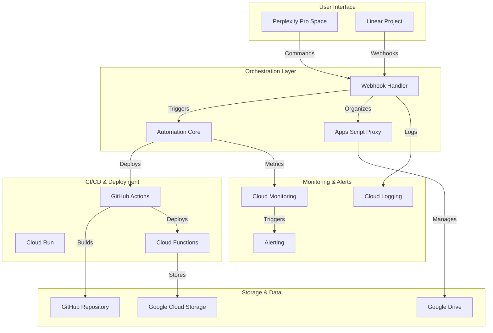
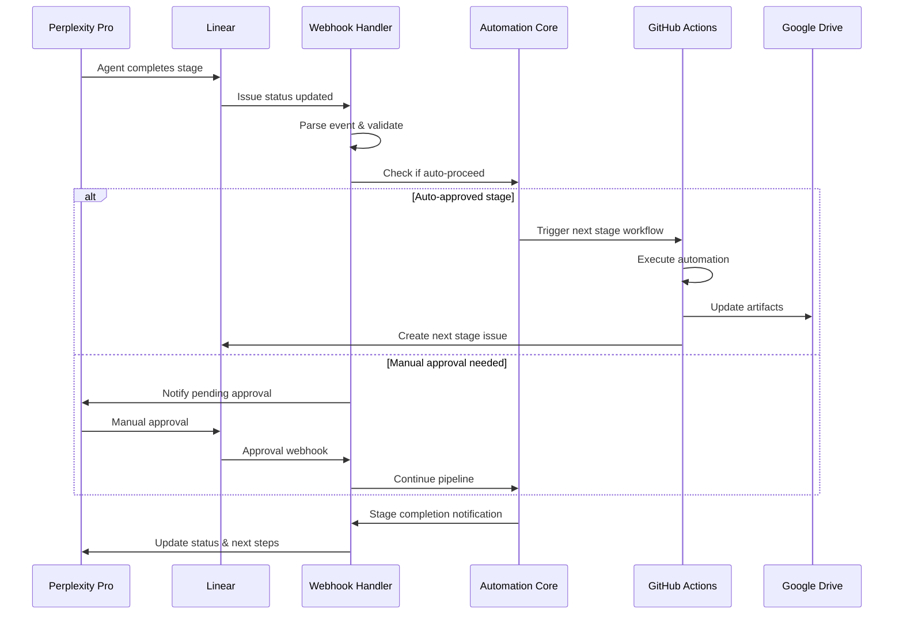
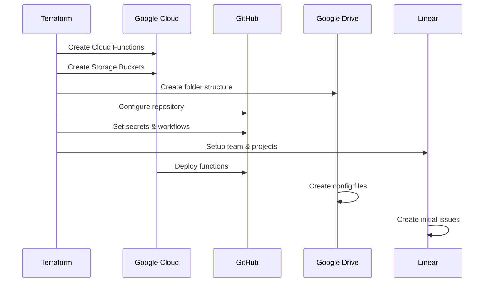
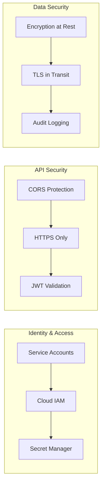
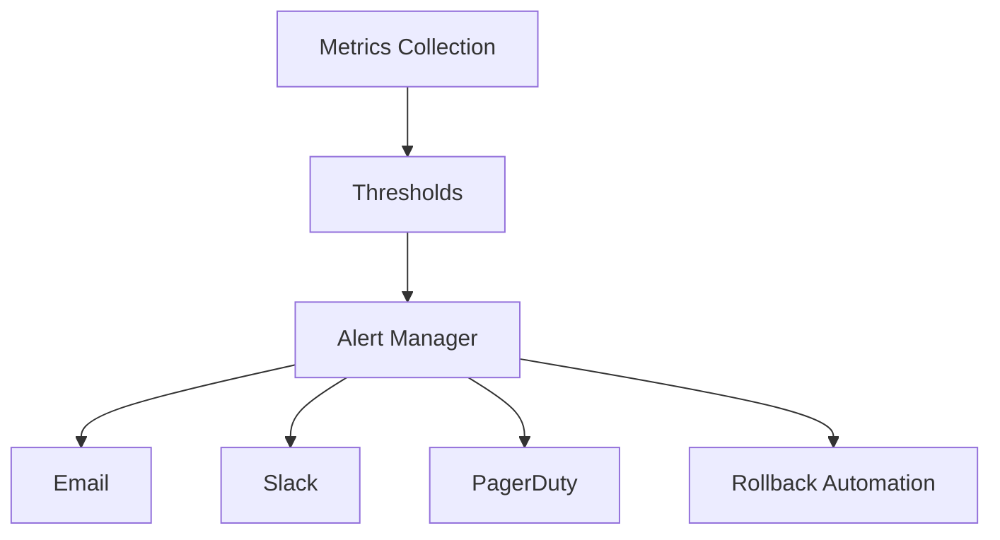
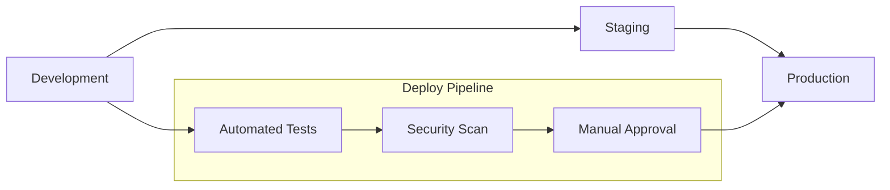

# Arquitetura - ADC-Agents-Team Pipeline

## 🏢️ Visão Geral da Arquitetura

O ADC-Agents-Team Pipeline implementa uma arquitetura **serverless e event-driven** para orquestrar automaticamente o desenvolvimento de aplicações LLM usando agentes AI especializados.

### Princípios Arquiteturais

- **Infrastructure as Code**: Tudo gerenciado via Terraform
- **Event-Driven Architecture**: Comunicação assíncrona via webhooks
- **Serverless-First**: Google Cloud Functions para lógica de negócio
- **GitOps**: Workflows automatizados via GitHub Actions
- **Observability**: Monitoramento e alertas integrados
- **Security by Design**: Least privilege e encryption por padrão

## 📊 Diagrama de Arquitetura



## 💻 Componentes Principais

### 1. Webhook Handler (`webhook_handler`)

**Responsabilidade**: Processa eventos do Linear e orquestra o pipeline

**Tecnologias**:
- Runtime: Python 3.11
- Framework: Flask + Functions Framework
- Deploy: Google Cloud Functions
- Trigger: HTTP requests

**Funcionalidades**:
- Recebe webhooks do Linear sobre mudanças de issues
- Identifica estágios completados (L1-L9)
- Decide sobre avanço automático vs manual
- Dispara GitHub Actions para próximo estágio
- Envia notificações (email/Slack)
- Health checks e debugging

**Fluxo de Dados**:
```
Linear Issue Update → Webhook → Parse Event → Validate Stage → 
Check Auto-Approval → Trigger Next Stage → Send Notifications
```

### 2. Automation Core (`automation_core`)

**Responsabilidade**: Lógica central de orquestração e coordenação

**Tecnologias**:
- Runtime: Python 3.11
- APIs: GitHub, Linear, Google Cloud
- Deploy: Google Cloud Functions
- Trigger: HTTP + Firestore events

**Funcionalidades**:
- Executa workflows complexos entre estágios
- Sincroniza estado entre Linear e GitHub
- Gerencia dependências entre estágios
- Orquestra deploys automatizados
- Coordena backup e recovery

### 3. Apps Script Proxy (`apps_script_proxy`)

**Responsabilidade**: Automação e organização do Google Drive

**Tecnologias**:
- Runtime: Python 3.11
- APIs: Google Drive, Google Docs
- Deploy: Google Cloud Functions
- Integration: Apps Script equivalent

**Funcionalidades**:
- Criação automática de documentos
- Organização de arquivos por estágio
- Templates dinâmicos baseados em agente
- Backup incremental de documentos
- Controle de permissões e sharing

## 🔄 Fluxos de Dados

### Fluxo Principal: Execução de Estágio



### Fluxo de Inicialização



## 🛠️ Stack Tecnológico

### Infrastructure & Platform
| Componente | Tecnologia | Versão |
|------------|------------|--------|
| **IaC** | Terraform | 1.6+ |
| **Cloud Provider** | Google Cloud Platform | - |
| **Compute** | Cloud Functions Gen 2 | Python 3.11 |
| **Storage** | Cloud Storage + Drive API | - |
| **Monitoring** | Cloud Monitoring + Logging | - |
| **Security** | Cloud IAM + Secret Manager | - |

### Development & CI/CD
| Componente | Tecnologia | Versão |
|------------|------------|--------|
| **VCS** | GitHub | - |
| **CI/CD** | GitHub Actions | - |
| **Package Management** | pip | Python 3.11 |
| **Testing** | pytest | 7.4+ |
| **Linting** | black, flake8 | Latest |

### Integrations & APIs
| Serviço | API | Autenticação |
|---------|-----|----------------|
| **Linear** | GraphQL API | API Key |
| **GitHub** | REST API v4 | Personal Access Token |
| **Google Drive** | Drive API v3 | Service Account |
| **Perplexity** | Manual Integration | Pro Space |
| **Slack** | Incoming Webhooks | Webhook URL |

## 🔒 Segurança e Conformidade

### Autenticação e Autorização



### Princípios de Segurança

1. **Least Privilege**: Cada componente tem apenas as permissões mínimas necessárias
2. **Defense in Depth**: Múltiplas camadas de segurança
3. **Encryption Everywhere**: Dados sempre criptografados em trânsito e repouso
4. **Audit Everything**: Logging completo de todas as ações
5. **Secure by Default**: Configurações seguras por padrão

### Controles de Segurança

| Controle | Implementação | Status |
|----------|-----------------|--------|
| **Authentication** | Service Account + OAuth2 | ✅ |
| **Authorization** | Cloud IAM RBAC | ✅ |
| **Encryption** | Google-managed keys | ✅ |
| **Network Security** | HTTPS + CORS | ✅ |
| **Secret Management** | Secret Manager | ✅ |
| **Audit Logging** | Cloud Audit Logs | ✅ |
| **Vulnerability Scanning** | Container Analysis | ✅ |
| **Compliance** | SOC 2 Type II (GCP) | ✅ |

## 📊 Monitoramento e Observabilidade

### Métricas Principais

| Métrica | Tipo | Threshold | Ação |
|---------|------|-----------|-------|
| **Function Errors** | Counter | > 5% | Alert + Rollback |
| **Response Time** | Histogram | > 10s | Scale Up |
| **Memory Usage** | Gauge | > 80% | Optimize |
| **API Rate Limits** | Counter | > 90% | Throttle |
| **Storage Usage** | Gauge | > 80% | Cleanup |
| **Pipeline Success Rate** | Counter | < 95% | Investigation |

### Dashboards

1. **Operational Dashboard**: Saúde geral do sistema
2. **Pipeline Dashboard**: Métricas de execução dos estágios
3. **Performance Dashboard**: Latência e throughput
4. **Error Dashboard**: Erros e falhas por componente
5. **Cost Dashboard**: Uso de recursos e custos

### Alertas



## 🚀 Performance e Escala

### Benchmarks de Performance

| Componente | Latência Média | Throughput | SLA |
|------------|------------------|------------|-----|
| **Webhook Handler** | < 500ms | 1000 req/min | 99.9% |
| **Automation Core** | < 2s | 100 req/min | 99.5% |
| **Apps Script Proxy** | < 1s | 500 req/min | 99.8% |
| **End-to-End Pipeline** | < 30min | 10 pipelines/hour | 95% |

### Estratégias de Escala

1. **Horizontal Scaling**: Cloud Functions escalam automaticamente
2. **Caching**: Cache de respostas frequentes
3. **Rate Limiting**: Proteção contra abuse
4. **Queue Management**: Processamento assíncrono
5. **Resource Optimization**: Auto-sizing baseado em usage

## 🔧 Deploy e Operações

### Estratégia de Deploy



### Ambientes

| Ambiente | Propósito | Deploy | Monitoramento |
|----------|-------------|--------|--------------|
| **Development** | Desenvolvimento local | Manual | Básico |
| **Staging** | Testes integrados | Auto (PR) | Completo |
| **Production** | Uso real | Auto (main) | Full + Alerts |

### Disaster Recovery

1. **Backup Strategy**: Backup diário automatizado
2. **Recovery Time Objective (RTO)**: < 4 horas
3. **Recovery Point Objective (RPO)**: < 1 hora
4. **Failover**: Automatic failover para região secundária
5. **Data Replication**: Multi-region replication

## 📚 Referências e Links

### Documentação Técnica
- [Google Cloud Functions](https://cloud.google.com/functions/docs)
- [Terraform GCP Provider](https://registry.terraform.io/providers/hashicorp/google/latest/docs)
- [GitHub Actions](https://docs.github.com/en/actions)
- [Linear API](https://developers.linear.app/docs)

### Best Practices
- [12-Factor App](https://12factor.net/)
- [Google Cloud Architecture Framework](https://cloud.google.com/architecture/framework)
- [Terraform Best Practices](https://www.terraform.io/docs/cloud/guides/recommended-practices)
- [Serverless Best Practices](https://cloud.google.com/serverless/whitepaper)

### Monitoramento
- [SRE Best Practices](https://sre.google/)
- [Cloud Monitoring](https://cloud.google.com/monitoring/docs)
- [Observability Engineering](https://www.oreilly.com/library/view/observability-engineering/9781492076438/)

---

*Documentação mantida pelo ADC-Agents-Team Pipeline v1.0.0*  
*Última atualização: Outubro 2025*